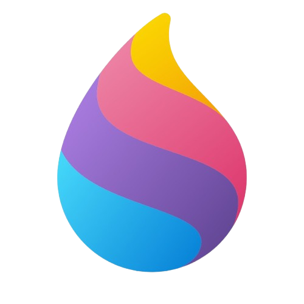

# Hi there 👋 My Name is Onwuka Chukwuemeka

## Web Developer & Data Analyst

I build responsive web applications and work with data to uncover insights and solve real-world problems. My interests span full-stack web development, data analysis, and building practical digital solutions.

* 🌍 Based in Lagos, Nigeria
* 📊 Skilled in data analysis, data cleaning, and
reporting using tools like Microsoft Excel and SQL
* 💻 Experienced in building modern websites using HTML, CSS, JavaScript, and modern web technologies
* 🧠 Continuously learning new technologies to improve my development and analytical skills
* 🤝 Open to collaborating on projects, web apps, and data-driven projects
* 🖥️ Explore my portfolio: [cosmas-emeka.vercel.app](http://cosmas-emeka.vercel.app)
* ✉️ Reach me at: [chukwuemekaonwuka86@gmail.com](mailto:chukwuemekaonwuka86@gmail.com)

### Get in Touch

### Skills

### Badges

<b>My GitHub Stats</b>:

